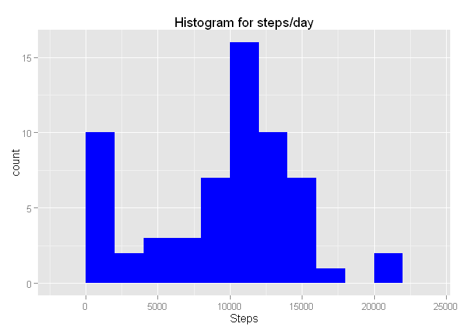
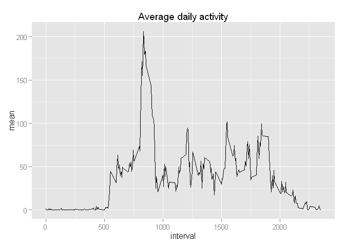
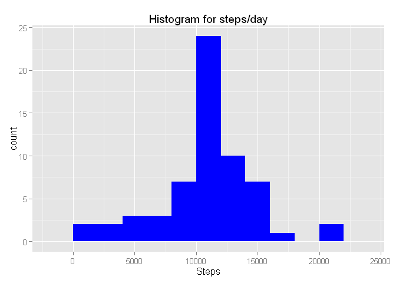
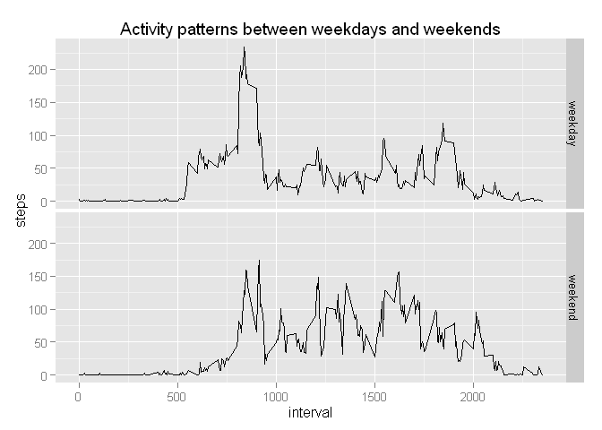

# Reproducible Research: Peer Assessment 1
Roberto J. Alcalá Sánchez  
10 June 2015  


## Loading and preprocessing the data.

Load the data specifying the column types, this way the date variable is imported as a R date column instead of a factor (or a character vector), and integer columns are of type integer and not numeric.


```r
# Load the data with the appropiate column types.
data <- read.csv("activity.csv", colClasses = c("integer", "POSIXct", "integer"))
```


## What is mean total number of steps taken per day?


```r
library(ggplot2)

# Get the total number of steps per day, ignoring missing values.
ans <- tapply(data$steps, data$date, sum, na.rm = TRUE)

total_steps <- data.frame(date = unique(data$date), steps = as.vector(ans))

qplot(total_steps$steps, geom = "histogram", fill = I("blue"), binwidth = 2000, xlab = "Steps", main = "Histogram for steps/day")
```

 

The mean is **9354.2** and the median is **10395**.


## What is the average daily activity pattern?


```r
# Get the mean number of steps per interval, ignoring missing values.
ans <- tapply(data$steps, data$interval, mean, na.rm = TRUE)

interval_mean <- data.frame(interval = unique(data$interval), mean = as.vector(ans))

qplot(interval, mean, data = interval_mean, geom = "line", main = "Average daily activity")
```

 

```r
# Find the maximum average.
max_avg  <- max(interval_mean$mean)
# Find the index position of the maximum average.
max_idx  <- which(interval_mean$mean == max_avg)
# Index the list of intervals by the maximum average index.
interval <- interval_mean$interval[max_idx]
```

The interval with the maximum daily average, **206.1698113**, correponds with **835**.

## Imputing missing values.

The number of missing values (nr. of rows) is **2304**.


```r
# Detect missing values.
missing <- which(is.na(data$steps))

# Make a new dataset from the original one.
data_nomiss <- data

# For each missing value, get the interval and from the interval value get the interval mean value and return it.
data_nomiss$steps[missing] <- sapply(missing, function(idx) {
    interval_value <- data_nomiss$interval[idx]
    interval_index <- which(interval_mean$interval == interval_value)
    interval_mean  <- interval_mean$mean[interval_index]

    return(interval_mean)
})

# Get the number of steps per day.
ans <- tapply(data_nomiss$steps, data_nomiss$date, sum)
total_steps <- data.frame(date = unique(data_nomiss$date), steps = as.vector(ans))

qplot(total_steps$steps, geom = "histogram", fill = I("blue"), binwidth = 2000, xlab = "Steps", main = "Histogram for steps/day")
```

 

The mean is **10766.2** and the median is **10766.2**.

The values has increases compared to the results obtained in the first part. This is because missing values (value NA in R) were treated as zeros and so the histogram showed a tall bar in bin containing the zero value. Now the imputed value is the mean, so there are few values in the zero bin and more in the bin corresponding to the mean.


## Are there differences in activity patterns between weekdays and weekends?


```r
Sys.setlocale("LC_ALL", "English")
```

```
## [1] "LC_COLLATE=English_United States.1252;LC_CTYPE=English_United States.1252;LC_MONETARY=English_United States.1252;LC_NUMERIC=C;LC_TIME=English_United States.1252"
```

```r
# Create a factor variable indicating the day type (weeday or weekend).
data$daytype <- factor(sapply(data$date, function (date) {
    if (weekdays(date) %in% c("Saturday", "Sunday")) {
        return("weekend")
    }
    else {
        return("weekday")
    }
}))

# Split the data according to it.
data_split <- split(data, data$daytype)

# Average each type of day interval separately.
steps_weekday <- tapply(data_split$weekday$steps, data_split$weekday$interval, mean, na.rm = TRUE)
steps_weekend <- tapply(data_split$weekend$steps, data_split$weekend$interval, mean, na.rm = TRUE)

# Do a dataset for each type of day containing the interval, average number of steps and the type of day.
steps_weekday <- data.frame(
    daytype  = "weekday",
    interval = as.integer(rownames(steps_weekday)),
    steps    = steps_weekday
)

steps_weekend <- data.frame(
    daytype  = "weekend",
    interval = as.integer(rownames(steps_weekend)),
    steps    = steps_weekend
)

# Integrate the results.
total_steps <- rbind(steps_weekday, steps_weekend)
total_steps$daytype <- factor(total_steps$daytype)

qplot(interval, steps, data = total_steps, geom = "line", facets = daytype ~ ., main = "Activity patterns between weekdays and weekends")
```

 

We can clearly see that in weekdays, the people walk a lot around 6 AM and 9 AM, and a high spike between 7 and 8 AM, when most people go to work. The people also walks a little bit more around 5 and 8 PM, when returning home.

On weekend days, there are not so noticeable patterns although still many people start walking around 8 and 9 AM, when most people wake up. Then the activity is higher than in weekdays, probably because many people have a kind of job where they sit down most of the time. On weekends people walks and travels longer than when working.
